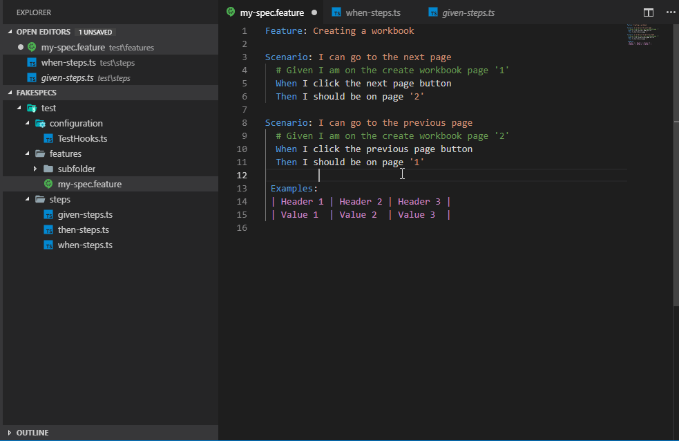

# Jest-Flow

# Description
This extensions automatically generates sister `.ts` files for the `.feature` files. Inspired by SpecFlow
The user can then use the command `Generate Step` (alt + F12 default) to copy the step to buffer and past it into the appropriate file.
Works very well with the `Cucumber (Gherkin) Full` Support extensions which will enable squgglies for unfound steps and go to definition.

# To use this extension
- run `npm install`
- run `npm install -g vsce`
- run `vsce package` to build the .vsix file
- open VS Code
- select extensions
- click 3 dots (more options) and choose install from VSIX

# To-Do
I want to make the locations for the steps and test hooks configurable and then publish it to the public extension list in VS Code.

# Demo 

